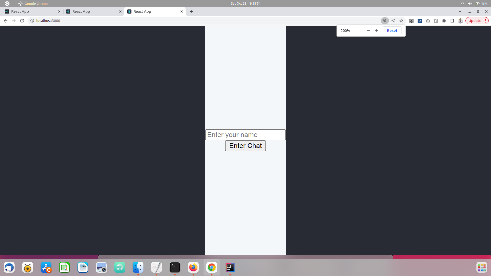
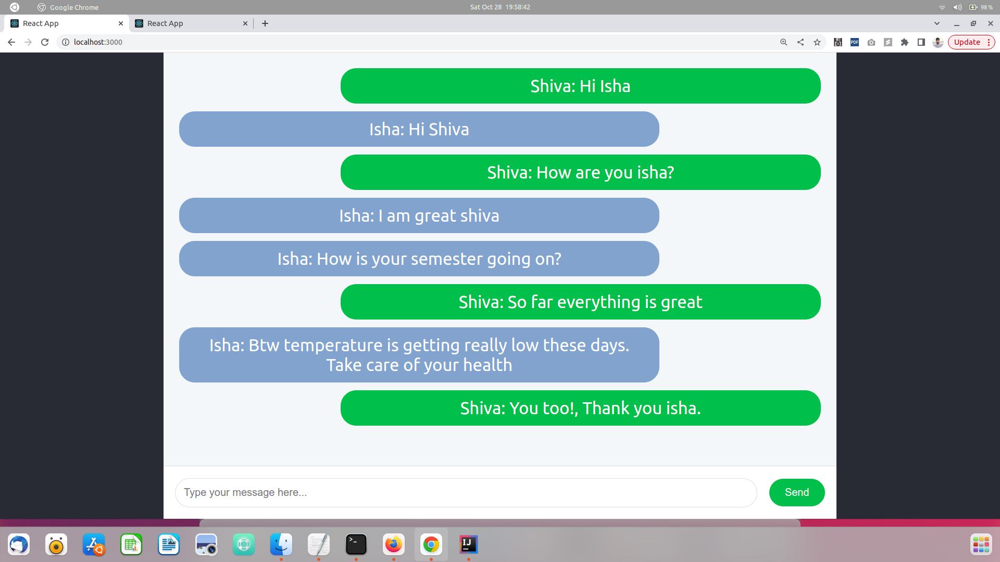
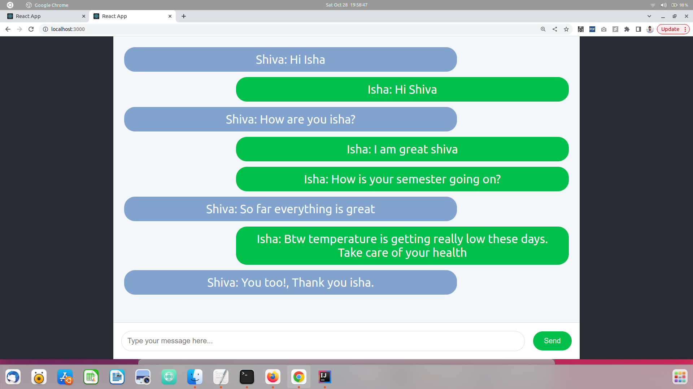

# 🚀 Application-1

<div align="center" style="border: 1px solid #ddd; padding: 10px; margin: 20px 0;">
    
    
    
</div>

---

## 🛠️ Frameworks Used

### 🌐 Frontend
- **React JS**

### 🌐 Backend
- **Spring Boot**

---

## ⚙️ Running Backend

1. Install Java and Spring Boot
2. Navigate to backend:
    ```bash
    cd backend
    ```
3. Package the application:
    ```bash
    mvn clean package
    ```
4. Run the application:
    ```bash
    java -jar target/backend-0.0.1-SNAPSHOT.jar
    ```

---

## 🌍 Running Frontend

1. Install npm package manager
2. Navigate to frontend:
    ```bash
    cd frontend
    ```
3. Install required packages:
    ```bash
    npm install
    ```
4. Start the frontend server:
    ```bash
    npm start
    ```

---


